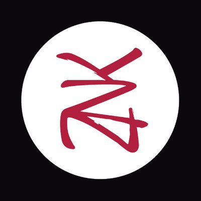

:revealjs_theme: white
:revealjs_center: false
:icons: font
:iconfont-cdn: css/font-awesome.min.css
:customcss: customcss.css
= Sécurisez vos applications avec Keycloak

[%notitle]
== @me

*Jérôme Marchand*

[link="https://www.zenika.com"] 

* icon:twitter[] : https://twitter.com/Neken13[@Neken13]
* icon:github[] : https://github.com/atadilo

== Disclaimer

== Rappels

image::images/keycloak_logo_480x108.png[]

[quote, https://en.wikipedia.org/wiki/Keycloak]
Keycloak is an open source software product to allow single sign-on with Identity Management and Access Management aimed at modern applications and services. 

== Notions

[cols="a,a"]
|===
|* Realm (royaume/territoire) 
* Users 
* Roles  
* Groups 
|* Clients (point d'entrée) 
* Identity Providers
* Authentication 
* User Federation
|===

== Admin

* kcadm
* import

== Token/Mapper

* roles
* roles composite
* groupes
* custom

== API

* Rôles dans le Token
** realm roles
** clients roles
* user-infos
* Valider le token
** http://localhost:8080/auth/realms/RennesDevOPS/protocol/openid-connect/certs

== Events

* Config

== Federation

* SPI fichier local

