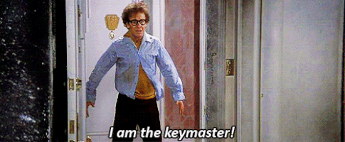
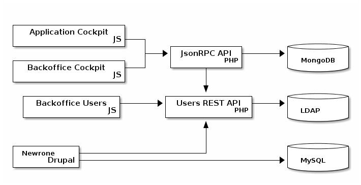
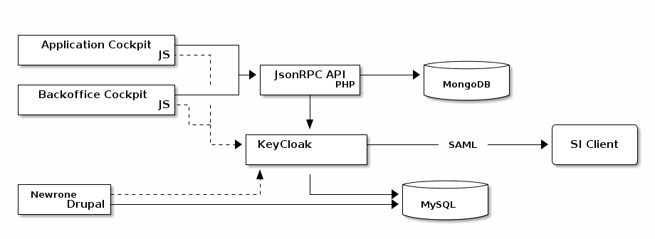

:revealjs_theme: white
:revealjs_center: false
:icons: font
:iconfont-cdn: css/font-awesome.min.css
:customcss: customcss.css
= Keycloak, le maître des clés

[%notitle]
== Gif

*Vinz Clortho*

 

[%notitle]
== @me

*Jérôme Marchand*

 
SysAdmin, LeadDev, DevOps 

* icon:twitter[] : https://twitter.com/Neken13[@Neken13]
* icon:github[] : https://github.com/atadilo

[.fragment]
--
Soon :

image::images/zenika.jpg[width=100]
--

== Disclaimer

== Etat initial

== Nouveau besoin

Connexion à *Cockpit* via l'AD du client avec SAML2.
[.fragment]
--
Les solutions envisagées pour minimiser les développements dans notre "Users REST API":
--
[%step]
* Implémenter les bouts du protocole dont nous avons besoin ... 
* Intégrer une(des) librairie(s) SAML2 ...

[.fragment]
--
Ou pas !
--

[%notitle]
== Proposition -> Poc -> Adoption

image::images/keycloak_logo_480x108.png[]

[quote, https://en.wikipedia.org/wiki/Keycloak]
Keycloak is an open source software product to allow single sign-on with Identity Management and Access Management aimed at modern applications and services. 

== Etat initial

=== Nouvelle architecture 

== Notions

[cols="a,a"]
|===
|* Realm (royaume/territoire) 
* Users 
* Roles  
* Groups 
|* Clients (point d'entrée) 
* Identity Providers
* Authentication 
* User Federation
|===

== Démo

video::images/PeskyThickArachnid.webm[options="autoplay,loop"]

== Questions

video::images/NauticalPoshCur.webm[options="autoplay,loop"]

